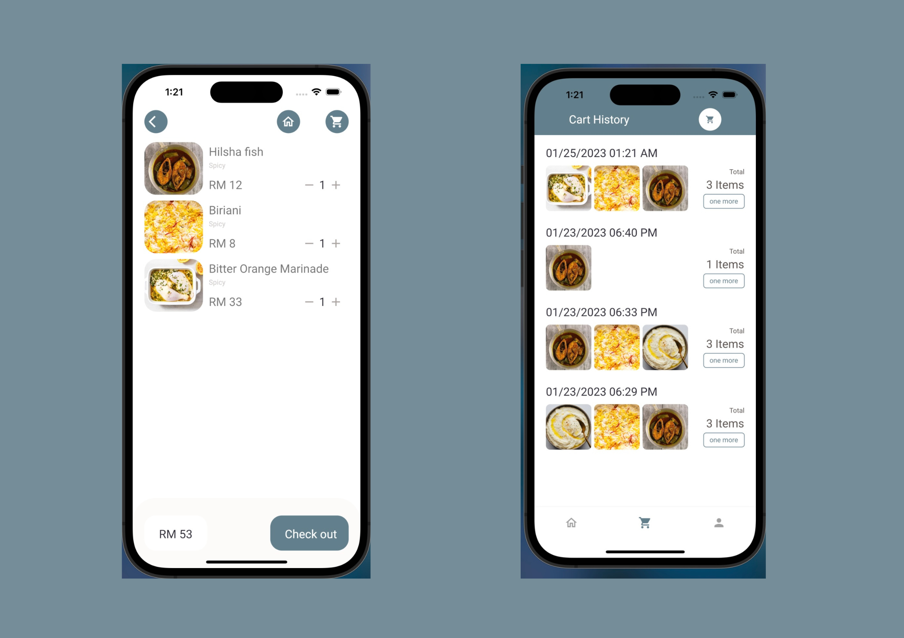

# Flutter E-commerce (Food)

## Sign In & Sign Up Page

 

## Food List & Food Details Page

 

## Cart List & Cart History Page

 

## Address & Maps Page

 

## Profile Page

 

A few resources to get you started if this is your first Flutter project:

- [Lab: Write your first Flutter app](https://flutter.dev/docs/get-started/codelab)
- [Cookbook: Useful Flutter samples](https://flutter.dev/docs/cookbook)

For help getting started with Flutter, view our
[online documentation](https://flutter.dev/docs), which offers tutorials,
samples, guidance on mobile development, and a full API reference.
